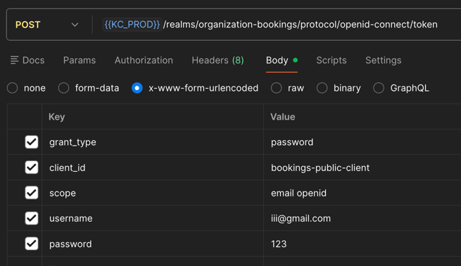
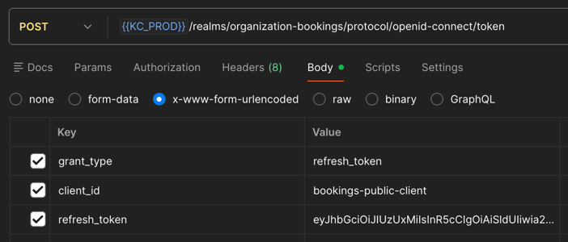

# Интеграция с сервисом

## Интеграция по HTTP

Для интеграции с сервисом реализованы internal ручки, которые не требуют авторизации:

- POST /api/internal/authorization/check - Проверка, есть ли у пользователя право в организации (identityId + permissionCode -> allowed)
- GET /api/internal/users/by-identity/{identityId} - Получение профиля пользователя по identityId (sub из access токена Keycloak)
- POST /api/internal/organizations/owner - Назначение владельца организации (создание членства и выдача роли ORG_OWNER)
- GET /api/internal/organizations/{organizationId}/users/{identityId}/permissions - Получение всех прав пользователя в организации
- GET /api/internal/organizations/{organizationId}/users/{identityId}/roles - Получение всех ролей пользователя в организации
- GET /api/internal/organizations/{organizationId}/users/{identityId}/membership - Получение данных членства пользователя в организации
- GET /api/internal/users/{identityId}/organizations?status=Active - Получение списка организаций пользователя с фильтром по статусу членства

identityId - id пользователя в Keycloak, его нужно получить из JWT токена

Список ролей, прав и их матрица представлена в [документе](RolesPermissionsMatrix.md)

## Подключение авторизации для запросов с фронтенда в .NET сервис

### Конфигурация

#### docker-compose.yml

```yaml
environment:
  - Authentication__TokenValidationParameters__ValidIssuers__2=${KEYCLOAK_ISSUER}
```
На хосте в.env положить KEYCLOAK_ISSUER=http://{SSH_HOST}:8082/realms/organization-bookings (SSH_HOST заменить)

#### appsettings.json

```json
{
  "Authentication": {
    "Audience": "account",
    "TokenValidationParameters": {
      "ValidIssuers": [ 
        "http://keycloak:8080/realms/organization-bookings",
        "http://localhost:8082/realms/organization-bookings"
      ]
    },
    "MetadataAddress": "http://keycloak:8080/realms/organization-bookings/.well-known/openid-configuration",
    "RequireHttpsMetadata": false
  }
}
```

#### program.cs

```csharp
builder.Services.AddAuthorization();

builder.Services.AddAuthentication().AddJwtBearer(options =>
    {
        configuration.GetSection("Authentication").Bind(options);
    });

builder.Services.AddHttpContextAccessor();

app.UseAuthentication();
app.UseAuthorization();
```

### Защита эндпоинтов

Для защиты ручек необходимо использовать атрибут `[Authorize]`

Для получения `identityId` необходимо использовать `var identityId = User.FindFirstValue(ClaimTypes.NameIdentifier);`

Пример:

```csharp
[Authorize]
[HttpGet("authenticate")]
public IActionResult TestAuth()
{
    var identityId = User.FindFirstValue(ClaimTypes.NameIdentifier);
    return Ok(identityId);
}
```

## Работа с токенами

### Регистрация пользователя

Для регистрации пользователя нужно вызвать ручку POST /api/users/register

### Получение токенов

Для получения access и refresh токенов нужно выполнить следующий запрос (KC_PROD = SSH_HOST:8082)



### Обновление access токена

Для обновления access токена нужно выполнить следующий запрос (KC_PROD = SSH_HOST:8082)


